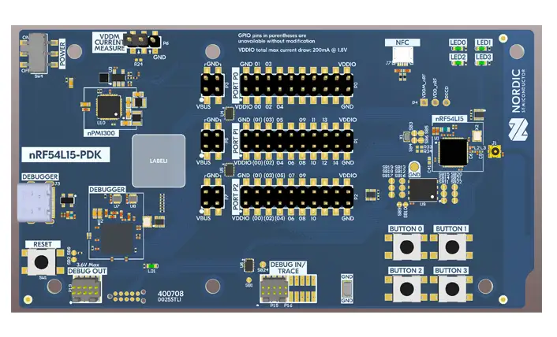

.. _nrf54l15pdk_nrf54l15:

nRF54L15 PDK
############

Overview
********

The nRF54L15 Preview Development Kit hardware provides
support for the Nordic Semiconductor nRF54L15 Arm Cortex-M33 CPU and
the following devices:

* :abbr:`SAADC (Successive Approximation Analog to Digital Converter)`
* CLOCK
* RRAM
* :abbr:`GPIO (General Purpose Input Output)`
* :abbr:`TWIM (I2C-compatible two-wire interface master with EasyDMA)`
* :abbr:`MPU (Memory Protection Unit)`
* :abbr:`NVIC (Nested Vectored Interrupt Controller)`
* :abbr:`PWM (Pulse Width Modulation)`
* :abbr:`GRTC (Global real-time counter)`
* Segger RTT (RTT Console)
* :abbr:`SPI (Serial Peripheral Interface)`
* :abbr:`UARTE (Universal asynchronous receiver-transmitter)`
* :abbr:`WDT (Watchdog Timer)`

     nRF54L15 PDK (Credit: Nordic Semiconductor)

Hardware
********

nRF54L15 PDK has two crystal oscillators:

* High-frequency 32 MHz crystal oscillator (HFXO)
* Low-frequency 32.768 kHz crystal oscillator (LFXO)

The crystal oscillators can be configured to use either
internal or external capacitors.

Supported Features
==================

The nrf54l15pdk_nrf54l15 board configuration supports the following
hardware features:

+-----------+------------+----------------------+
| Interface | Controller | Driver/Component     |
+===========+============+======================+
| SAADC     | on-chip    | adc                  |
+-----------+------------+----------------------+
| CLOCK     | on-chip    | clock_control        |
+-----------+------------+----------------------+
| RRAM      | on-chip    | flash                |
+-----------+------------+----------------------+
| GPIO      | on-chip    | gpio                 |
+-----------+------------+----------------------+
| TWIM      | on-chip    | i2c                  |
+-----------+------------+----------------------+
| MPU       | on-chip    | arch/arm             |
+-----------+------------+----------------------+
| NVIC      | on-chip    | arch/arm             |
+-----------+------------+----------------------+
| PWM       | on-chip    | pwm                  |
+-----------+------------+----------------------+
| GRTC      | on-chip    | counter              |
+-----------+------------+----------------------+
| RTT       | Segger     | console              |
+-----------+------------+----------------------+
| SPI(M/S)  | on-chip    | spi                  |
+-----------+------------+----------------------+
| SPU       | on-chip    | system protection    |
+-----------+------------+----------------------+
| UARTE     | on-chip    | serial               |
+-----------+------------+----------------------+
| WDT       | on-chip    | watchdog             |
+-----------+------------+----------------------+

Other hardware features have not been enabled yet for this board.

Programming and Debugging
*************************

Flashing
========

To run a sample on the nRF54L15, you need to install all the
required software.

This example shows the :ref:`hello_world_user` sample,
which uses the ``nrf54l15pdk_nrf54l15_cpuapp`` build target.

To build and program the sample to the nRF54L15 PDK, complete the following steps:

1. Connect the nRF54L15 PDK to you computer using the IMCU USB port on the PDK.
#. Navigate to the :file:`zephyr/samples/hello_world` folder containing the sample.
#. Build the sample by running the following command::

      west build -b nrf54l15pdk_nrf54l15_cpuapp

#. Program the sample using the standard |Zephyr| command.
   If you have multiple Nordic Semiconductor devices, make sure that only the nRF54L15 PDK
   you want to program is connected.

   .. code-block:: console

      west flash

   .. note::

      When programming the device, you might get an error similar to the following message::

         ERROR: The operation attempted is unavailable due to readback protection in
         ERROR: your device. Please use --recover to unlock the device.

      This error occurs when readback protection is enabled.
      To disable the readback protection, you must *recover* your device.

      Enter the following command to recover the core::

         west flash --recover

      The ``--recover`` command erases the flash memory and then writes a small binary into
      the recovered flash memory.
      This binary prevents the readback protection from enabling itself again after a pin
      reset or power cycle.

Testing the LEDs and buttons in the nRF54L15 PDK
************************************************

You can test the nRF54L15 PDK with a preprogrammed :ref:`blinky-sample` sample.

Complete the following steps to test if the PDK works correctly:

1. Connect the USB-C end of the USB-C cable to the **IMCU USB** port the nRF54L15 PDK.
#. Connect the other end of the USB-C cable to your PC.
#. Move the **POWER** switch to **On** to turn the nRF54L15 PDK on.

**LED2** will turn on and start to blink.

If something does not work as expected, contact Nordic Semiconductor support.
